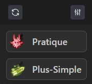
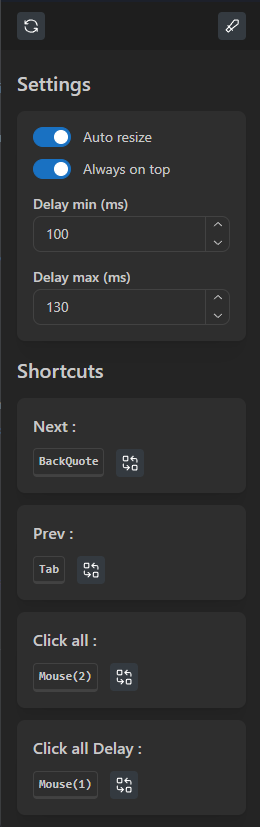

# Dofus Unity Multi-Account Tool

Un outil pratique pour faciliter la gestion du multi-compte sur Dofus Unity, offrant des fonctionnalités complémentaires aux options natives du jeu.

# Fonctionnalités

### Navigation entre fenêtres

- Navigation rapide entre les fenêtres de jeu (suivante/précédente)
- Raccourcis clavier entièrement configurables
- Focus instantané en cliquant sur le nom du personnage

### Système de clic multiple

- **Mode avec délai**

  - Click simultané sur toutes les fenêtres avec délai personnalisable
  - Délai min/max configurable pour éviter la détection
  - Recommandé pour la plupart des actions

- **Mode instantané**
  - Click simultané sans délai
  - ⚠️ À utiliser avec précaution : uniquement pour les interactions PNJ et quêtes
  - Ne pas utiliser pour les déplacements sous peine de bannissement

### Paramètres

- Auto-resize des fenêtres
- Mode "Toujours au premier plan"
- Configuration des délais (min/max)
- Personnalisation complète des raccourcis (clavier & souris)

## Installation

1. Téléchargez le fichier MSI depuis la section "Releases"
2. Exécutez le fichier MSI
3. Suivez les étapes d'installation
4. Lancez l'application depuis le menu démarrer ou le raccourci bureau
5. Configurez vos raccourcis selon vos préférences

## Contribution

Toute contribution est la bienvenue ! N'hésitez pas à :

- Rapporter des bugs via les Issues GitHub
- Suggérer des améliorations
- Proposer des pull requests
- Partager vos idées

## Avertissement

Cet outil est conçu pour faciliter la gestion multi-compte de manière légitime. L'utilisation des fonctionnalités de clic instantané pour les déplacements est interdite et peut entraîner un bannissement.

